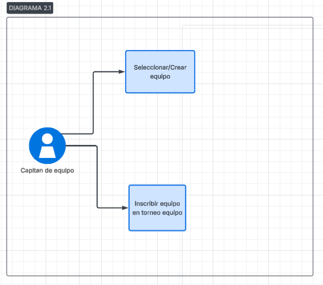
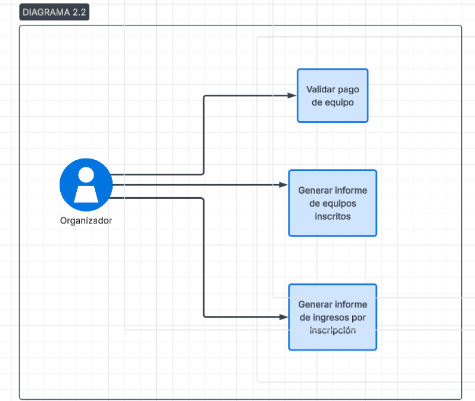
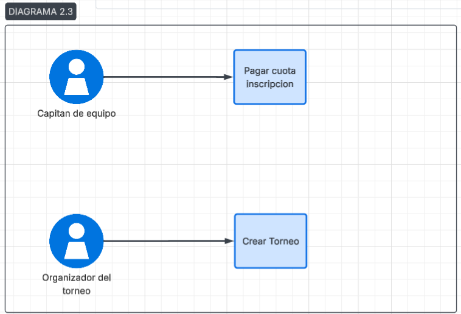

# 📄 Requerimientos del Sistema

## 1. Lista general de requerimientos

El sistema de TechCup tiene los siguientes requerimientos (descripción a alto nivel):

### 1.1 Requerimientos funcionales

El sistema de TechCup debe tener la capacidad de:

1.Crear equipos(para capitanes) y torneos(habilitado para organizadores)
2.Consultar información de torneos y equipos(usuarios en general)
3.Inscripción a torneos y equipos(para capitanes)
4.Validar pago, generar informes de pago(para organizador)
5.Gestionar los torneos y equipos(capitanes y organizadores)

### 1.2 Requerimientos no funcionales

El sistema de TechCup debe tener:

1.Paleta de colores de los colores del logo(#A50F16(rojo vinotinto), #272827(negro), #FDFDFD(blanco))
2.Fuentes claras y visibles(Montserrat, Roboto, Poppins)
3.Escalabilidad para mas competencias(poder aumentar el numero de personas que usen la aplicación)
4.Portabilidad(el sistema funciona en cualquier dispositivo)
5.Seguridad(cifrado de datos, autenticación de usuarios)

## 2. Diagramas de caso de uso

### 2.1 Requerimiento Funcional 1

| Campo | Descripción |
|------|-------------|
| **ID** | RF-01 |
| **Nombre del requerimiento** | Inscribir equipo en el torneo activo |
| **Descripción** | El sistema debe permitir que un capitán registre su equipo y lo inscriba en el torneo que se encuentre activo, además de incluir el pago de la cuota de inscripción a través de PSE. |
| **Precondiciones** | Debe existir un torneo en estado activo; el capitán debe estar autenticado y el equipo no debe estar previamente inscrito en el torneo. |
| **Actor** | Capitán de equipo |
| **Flujo principal** | 1. El capitán inicia sesión y selecciona/crea su equipo. 2. El capitán solicita inscribir el equipo en el torneo activo. 3. El sistema redirige al capitán a PSE para realizar el pago de la cuota de inscripción. 4. El sistema registra el equipo como inscrito cuando el pago se confirme. |
| **Diagrama de caso de uso** |  |
| **Poscondiciones** | El equipo queda registrado como inscrito en el torneo activo, con el pago en estado pendiente de verificación por el organizador. |

**Historia de Usuario**

COMO capitán del equipo
QUIERO crear e inscribir un equipo
PARA PODER registrar el equipo y participar en el torneo activo en la plataforma

### 2.2 Requerimiento Funcional 2

| Campo | Descripción |
|------|-------------|
| **ID** | RF-02 |
| **Nombre del requerimiento** | Validar el pago de inscripción y generar informes del torneo |
| **Descripción** | El sistema debe permitir que un organizador consulte y verifique el pago realizado por un equipo, y genere informes de los equipos inscritos y de los ingresos por inscripción de un torneo. |
| **Precondiciones** | El organizador debe estar autenticado; deben existir equipos inscritos con pagos registrados en el torneo. |
| **Actor** | Organizador del torneo. |
| **Flujo principal** | 1. El organizador selecciona un torneo. 2. El organizador consulta el estado del pago de un equipo inscrito. 3. El sistema muestra la validación del pago y permite generar el informe correspondiente. |
| **Diagrama de caso de uso** |  |
| **Poscondiciones** | El organizador obtiene la confirmación del pago y el informe solicitado en el formato [JSON]. |

**Historia de Usuario**

COMO organizador del torneo
QUIERO validar pagos y generar informes del torneo
PARA PODER consultar los estados de pago de cada equipo y generar un informe según el pago realizado por dicho equipo.

### 2.3 Requerimiento Funcional 3

| Campo | Descripción |
|------|-------------|
| **ID** | RF-03 |
| **Nombre del requerimiento** | Crear un torneo o un equipo |
| **Descripción** | El sistema debe permitir que un organizador cree un nuevo torneo especificando sus reglas básicas, y que un capitán cree un nuevo equipo para participar en el torneo activo. |
| **Precondiciones** | El usuario debe estar autenticado con el rol que le corresponde (organizador o capitán); para crear un torneo no debe existir otro torneo activo al mismo tiempo. |
| **Actor** | Organizador del torneo y Capitán de equipo. |
| **Flujo principal** | 1. El usuario inicia sesión con su rol. 2. Si es organizador, ingresa la información del nuevo torneo y lo crea en estado "pendiente". 3. Si es capitán, ingresa la información del nuevo equipo y lo registra en el sistema. |
| **Diagrama de caso de uso** |  |
| **Poscondiciones** | El torneo queda creado en estado pendiente, o el equipo queda registrado en el sistema para inscribirse en el torneo activo. |

**Historia de Usuario**

COMO capitán del equipo
QUIERO pagar la cuota de inscripción de mi equipo
PARA PODER registrar el pago como completado e inscribir al equipo en el torneo.

COMO organizador del torneo
QUIERO crear un torneo con estado "pendiente"
PARA PODER habilitarlo y permitir que los equipos se inscriban en él.

## 3. Preguntas

### i. ¿Identifica algún requisito que deba detallarse con mayor precisión? ¿Cuál o cuáles?

"Gestionar los torneos y equipos" es muy genérico: no especifica qué acciones de gestión incluye (como: editar información o cambiar estado). De igual forma, "Escalabilidad para más competencias" no define una métrica concreta (por ejemplo, número de usuarios concurrentes)

### ii. ¿Existen requisitos que se contradigan entre sí? ¿Cuáles?

Si, ya que la regla de negocio del caso "los torneos no se pueden eliminar" contradice la funcionalidad general escrita en el mismo caso, "Eliminar un torneo y sus equipos registrados", atribuida al organizador.

### iii. Si tuvieras que priorizar los requisitos, ¿cuáles dos deberían considerarse los más importantes e implementarse en la primera iteración del proyecto?

Crear equipos y torneos e Inscripción a torneos y equipos, ya que son la base funcional sin la cual el resto de funcionalidades como pago, validación, e informes no tendrían sobre qué operar.

### iv. ¿Existe algún requisito que no deba implementarse?

La funcionalidad de eliminar un torneo, no debería implementarse tal como está descrita, ya que contradice la regla de negocio de que los torneos no se pueden eliminar. En cambio, esa necesidad debería resolverse con el estado "Cancelad".
