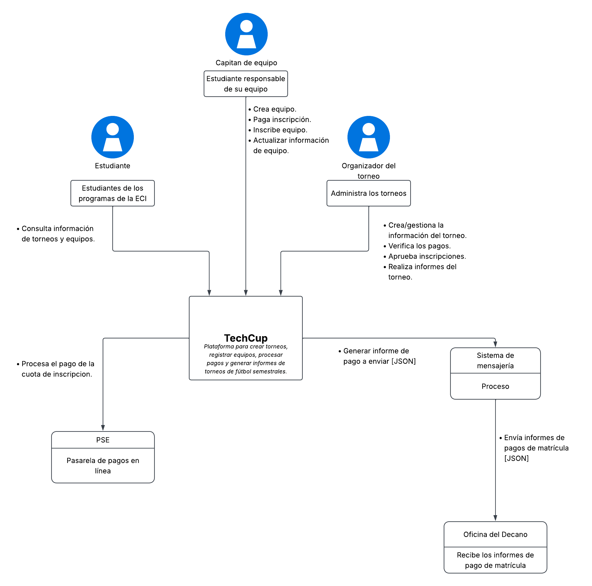

# 📄 Requerimientos del Sistema

## 1. Sistema

* Nombre del sistema: TechCup
* Objetivo: El sistema tiene como objetivo: Permitir crear torneos, registrar equipos, procesar pagos y generar informes de torneos de fútbol semestrales.

## 2. Problema a resolver
El principal problema a resolver de la plataforma es automatizar

## 3. Diagrama de Contexto

### 3.1 Diagrama

### 3.2 Actores

| Actor / Rol                        |          Descripción              |
|------------------------------------|:---------------------------------:|
| Estudiante | Consulta información de torneos y equipos. |
| Capitan del equipo| Puede crear e inscribir al equipo en los torneos. Además de pagar la inscripción y actualizar cualquier información del equipo. |
| Organizador | Gestiona el manejo de los equipos como verificar su pago, aprobar matriculas y manejar informes de los equipos. |

### 3.3 Sistemas externos

| Sistema                            |                                    Descripción                                        |
|------------------------------------|:-------------------------------------------------------------------------------------:|
| PSE | El medio por donde se pagarán las inscripciones.   |
| Sistema de mensajería | Cuando la plataforma valide el pago, este sistema enviará en formato JSON el informe a la oficina del Decano. |
| Oficina del Decano | Es quien da las reglas para que se puedan realizar los torneos y obtener reportes de pago. |

## 4. Alcance del sistema
   
### 4.1 Dentro del sistema

- Registrar a los estudiantes con usuario y contraseña.
- Autorizar a los usuarios (organizadores y capitanes) realizar ciertas acciones según su rol otorgado.
- Eliminar torneos y equipos matriculados.
- Agregar estudiantes a los equipos.

### 4.2 Fuera del sistema

- Crear torneos con requisitos mínimos.
- Procesar y validar pagos de inscripción en los equipos.
- Revisar si los equipos sí están inscritos en el torneo al que está inscrito.
- Transmitir los informes de pago de inscripción en el formato requerido.

